# CTAP Tracker — Visual Guide

A personal tool for Service & Repair Engineers to track the hours that count
toward their CTAP bonus, see where they stand in real time, and understand
what a positive balance is actually worth in their pocket.

> *Personal estimates only — verify against official systems. Not affiliated
> with Centrica plc, British Gas, or any employer.*

---

## Why this exists

The CTAP bonus scheme is real money on the table for engineers, but the way
it's surfaced through company tools is slow, retrospective, and hard to plan
around. By the time you find out a week is short, you can't do anything about
it. By the time you find out you're owed a payout, you're guessing how much
after tax.

CTAP Tracker fixes both:

1. **Live pace tracking** — see *today* whether you're on pace for this week,
   not next month when payroll catches up.
2. **Real take-home view** — see what your banked CTAP is actually worth
   after your personal multiplier and tax band, so the bonus becomes a real
   number instead of an abstract one.

Built by an engineer who got tired of finding out the bonus too late.

---

## Getting started

There is no account. There is no sign-in. You open it and it works.

### Install it

1. Open **https://belacorg.github.io/CTAPTracker/** in **Safari** on your
   iPhone (it has to be Safari — Chrome on iOS can't install web apps).
2. Tap the **Share** button, then **Add to Home Screen**.
3. Open it from the home-screen icon from now on, not from Safari. It runs
   full-screen and works with no signal.

### Set it up

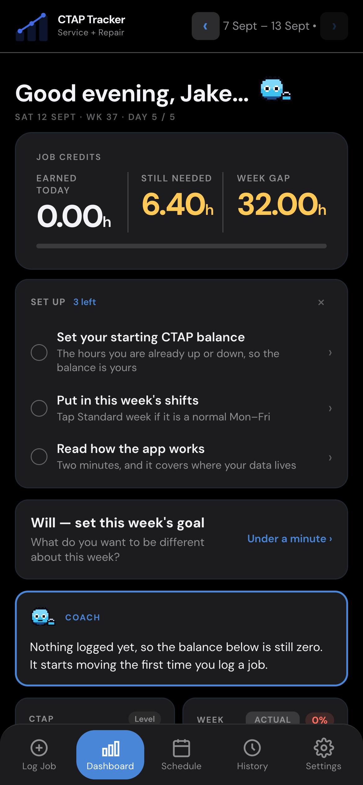

The Dashboard shows a short **Set up** card listing what's left to do. Three
things, each one tap away, and the card ticks them off and disappears once
they're done:

- **Your starting CTAP balance** — the hours you're already up or down. This
  is the one that matters. Without it every balance the app shows you starts
  from zero, which is almost certainly not where you are.
- **This week's shifts** — tap **Standard week** if yours is a normal
  Mon–Fri.
- **How the app works** — two minutes, and it covers where your data lives.

If you're genuinely level, still tap into the balance and enter 0 — that
counts as an answer and stops the card asking.

### Where your figures go

**Nowhere.** Everything you log stays in this app on this phone. There's no
account to create, no server behind it, and nothing is uploaded — not to me,
not to your employer, not to anyone. The app makes no network requests at
all once it's installed; it doesn't even fetch its own fonts.

The flip side is the part worth knowing before you start: **there's no backup**.
Delete the app, erase the data in Settings, or lose the phone, and it's gone.
Nobody can recover it for you, because nobody else ever had it.

---

## The Schedule tab

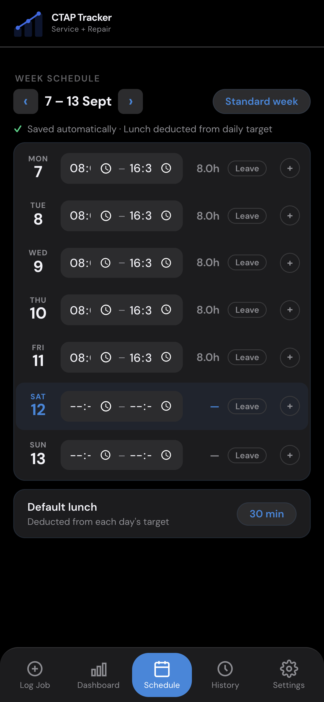

This is where you set up your working week — start time, end time, lunch,
and any annual leave.

### Key actions

- **Tap a time** to edit. Saves automatically.
- **"Standard week"** button applies Mon–Fri 08:00–16:30 with your default
  lunch. One tap if your week is normal.
- **"Leave"** chip per day toggles annual leave. That day drops out of your
  weekly target — important because you don't get penalised for being off.
- **Default lunch** chip at the bottom controls how many minutes are
  deducted from each day's target by default.
- **Note button (+)** at the end of each day-row opens a small notes
  textarea. Fills with a dot (●) once a note exists, so days with context
  are easy to scan.

### Why daily notes (not weekly)?

Originally there was a single week-level note field. In practice almost
everything worth recording was about *one specific day* — traffic, customer
no-show, training, van in for service. So the week note was replaced with
per-day notes. They also surface read-only in the Weekly Forecast day-detail
panel, so when you (or a manager) reviews a past day, the context sits right
next to the numbers.

---

## The Log Job tab

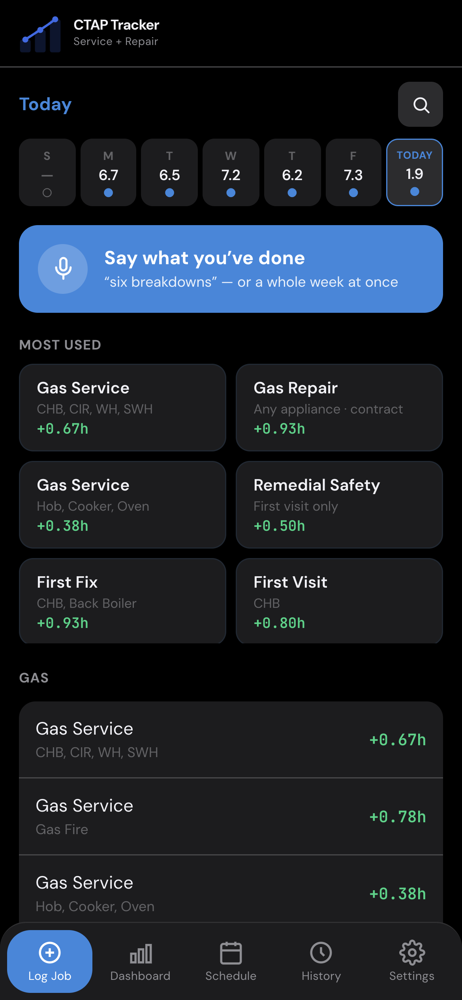

Categories: **Core**, **Hive**, **Sales**, **Absence**. Each contains tiles
for the jobs you'd actually log.

### Key actions

- **Tap a solid tile** to log instantly at the standard credit time.
- **Tap a dashed tile** for variable jobs — it'll prompt for the extra input
  (e.g. minutes spent, units fitted) and calculate credit from that.
- **Day picker** at the top lets you log against past days if you forgot to
  enter something at the time.

### Why category tiles instead of a typed list?

Engineers don't have time to type a job name on a phone keyboard between
appointments. Tiles are one-tap. The most common jobs sit at the top of each
category so the muscle memory builds fast.

---

## Saying what you've done

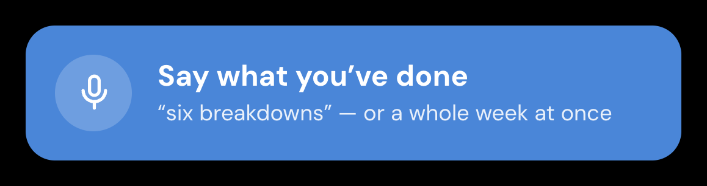

The blue bar at the top of Log Job is the fastest way in. Tap it and talk:

> *"Six breakdowns and two services."*

You can also catch up on a whole week in one go, naming the days as you speak:

> *"Monday six breakdowns, Tuesday three services and an inhibitor,
> Wednesday a long duration."*

Each day is parsed separately and the jobs land on the day you said them
against. Both orders work — *"Monday six breakdowns"* or *"six breakdowns on
Monday"*.

It also copes with what speech recognition does to trade numbers: *"too high
installs"* becomes 2 × Hive install, not a job called "too high".

### Nothing is written until you say so

What comes back is a **draft** — a list of proposed entries you can edit,
correct or throw away. Anything it couldn't match is shown to you rather than
silently dropped, so you always know what it didn't hear. Nothing reaches your
week until you confirm it.

**Why a draft and not a straight write?** Because the one thing worse than
typing jobs in by hand is finding out a fortnight later that your figures are
wrong and not knowing which ones.

---

## The Dashboard

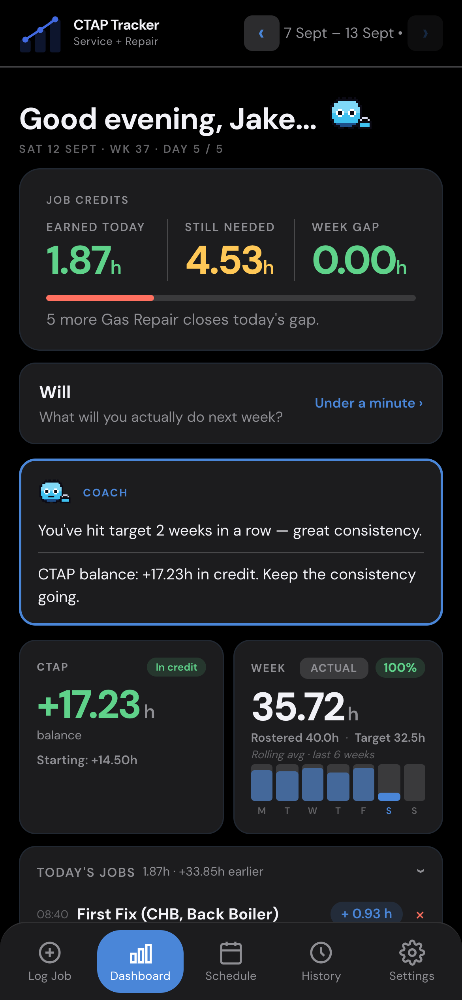

The dashboard is where you live day-to-day. It has four pieces stacked:
**JOB CREDITS** hero, **CTAP** balance tile, **Week** tile, **Today's Jobs** —
plus the Coach card and the day's check-in, both of which you can turn off.

### JOB CREDITS tile

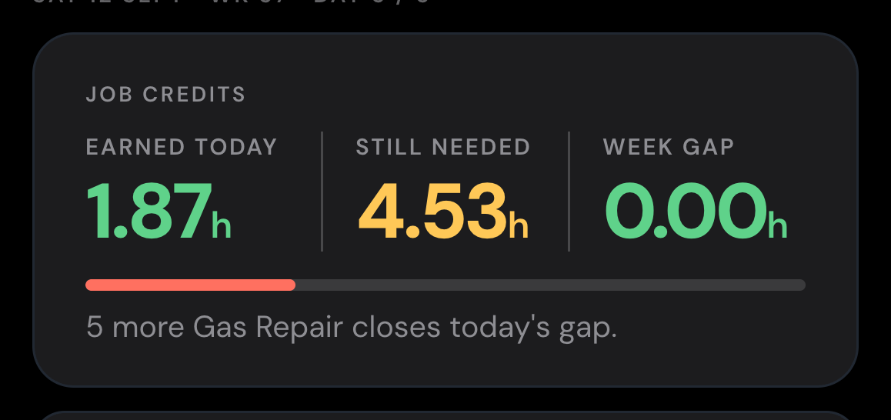

Three numbers across the top:

- **EARNED TODAY** — credit hours logged so far today
- **STILL NEEDED** — what you need before you hit today's daily target
- **WEEK GAP** — what the week as a whole still owes you

Below them is a **today progress bar**. It fills as you log jobs and turns
green when you've hit today's target.

#### Why the bar tracks today, not the week

The Week tile already shows weekly progress (the % badge). Putting a
*second* weekly indicator on the hero card was redundant. The hero card is
about *now* — what you've earned today, what you still need today. The bar
mirrors that intent.

### CTAP balance tile (tappable)

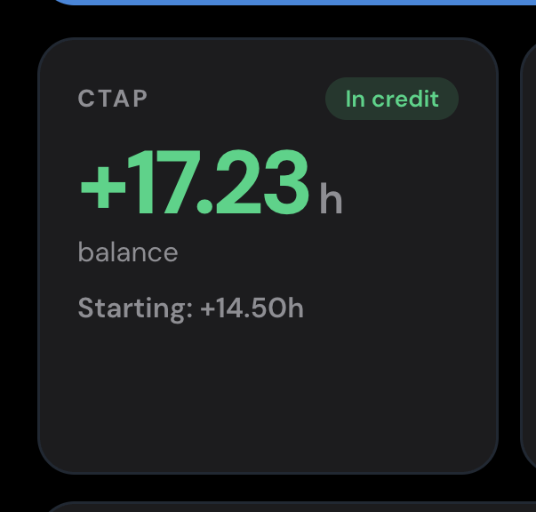

Your running credit or deficit, in hours. Green = in credit, red = in
deficit. Starts from your starting balance (set once in Settings) and
adjusts as completed weeks land.

**Tap the tile** to open the Cash-Out sheet.

### CTAP Cash-Out sheet

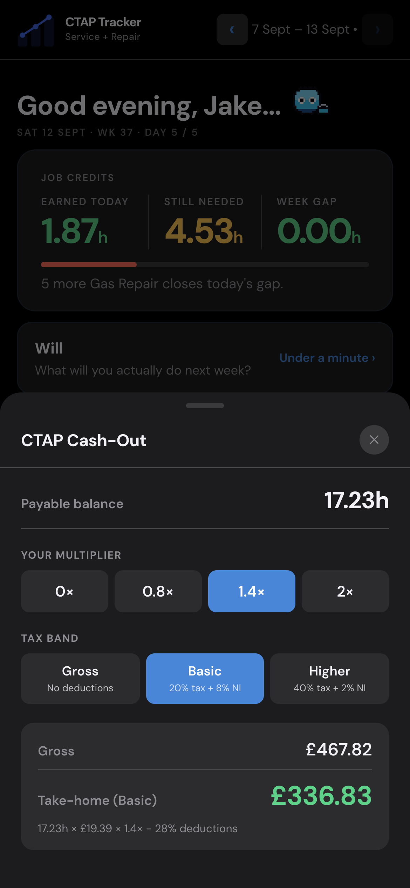

This is the headline feature. Pick your multiplier and tax band; see what
your current banked balance is actually worth after deductions.

- **Multiplier**: 0×, 0.8×, 1.4×, 2× — pick yours. The multiplier is on top
  of the base hourly rate (£19.39 for a Service & Repair Engineer).
- **Tax band**:
  - **Gross** — no deductions
  - **Basic** (28%) — 20% income tax + 8% NI
  - **Higher** (42%) — 40% income tax + 2% NI

The result card shows gross, take-home (large, in green), and the breakdown
line so you can see how the number was built.

#### Why no negative cash-out

If your balance is in deficit, the sheet shows £0 and a small note. You
can't cash out a deficit — you just can't withdraw — so showing a negative
£ figure would be misleading. When you go into credit, the cash-out becomes
live.

### Week tile (tappable)

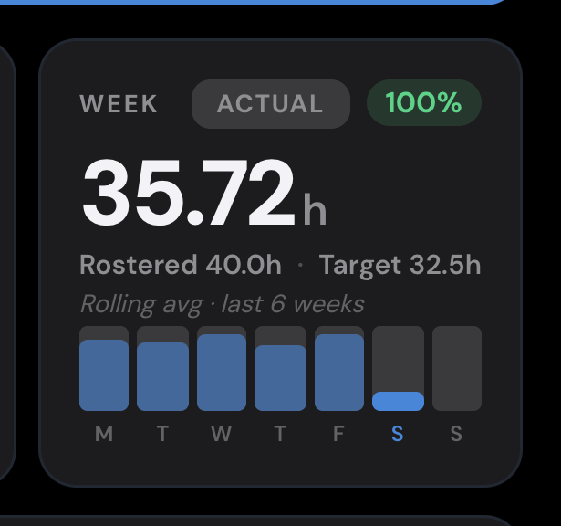

The week at a glance:

- **% badge** — % of weekly target earned.
- **Actual / Projected** toggle — flips the headline hours figure between
  what's actually banked and what you're on pace to finish at.
- **Daily bar chart** — quick visual of each weekday's earnings.
- **Tap the tile** to open the Weekly Forecast sheet.

#### Why the % colour is pace-aware

The % badge isn't coloured by absolute threshold (e.g. "green ≥90%"). For
the current week, it's coloured by *pace*: are you at or ahead of where you
should be by today?

Concrete example: it's Tuesday morning. Only Monday is done, so you should
be roughly 20% through the week. If you're at 23%, that's slightly ahead of
pace — the badge is green. Telling an engineer they're "amber" at 23% on a
Tuesday would be nonsense; they're actually doing fine.

Past and future weeks fall back to absolute thresholds since pace doesn't
apply to them.

### Weekly Forecast sheet

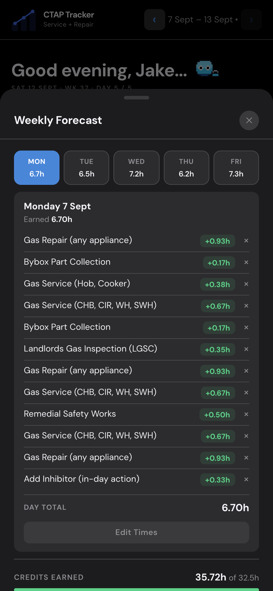

Opens from the Week tile. Full-screen, swipe-down to dismiss.

- **Day strip** across the top — tap any weekday for that day's detail.
- **Day detail panel** — jobs logged, credit totals, day note (read-only,
  set on the Schedule tab), and an Edit Times button if you need to fix a
  timestamp.
- **Projected finish** — if you've worked at least one day, shows where the
  week will land at your current daily average.

### Today's Jobs

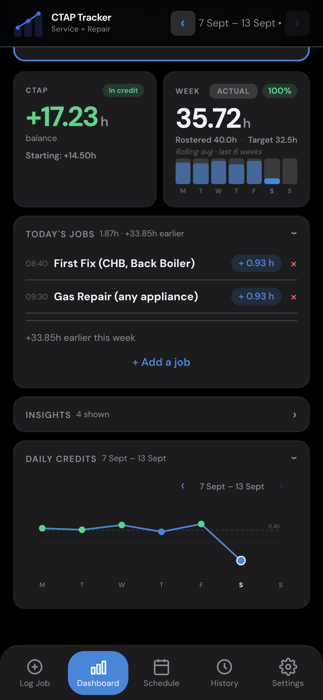

Collapsible list of every job, deduction, and mentor flag for today, with a
running total. Tap the ✕ on any line to remove it.

The **"+ Add a job"** button sits at the bottom of this section *whether or
not* anything's been logged. One tap to jump to the Log Job tab.

#### Why the button is always there

Originally the empty state had a "tap to log one" button, but once you had a
job logged the button vanished and adding a second one meant tabbing to Log
Job manually. It was friction. Keeping the button always-visible at the
bottom mirrors how chat apps put "compose" persistently in view — the most
common next action is always one tap away.

---

## Coach

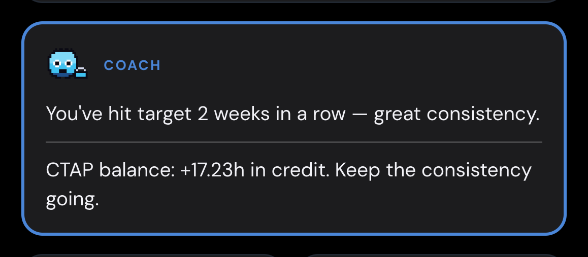

A bordered card on the Dashboard that reads your own figures back to you —
where your balance is going, how many weeks in a row you've hit target, what's
left to close this week.

Two things it deliberately won't do:

- **It never appears on Log Job.** That screen is for recording what you've
  done, usually one-handed between calls. Advice belongs on the tab you went
  to *because* you wanted to know where you stand.
- **It never tells you to do a job you weren't given.** Coach can only ever
  name work you genuinely choose — an inhibitor, a Hive product, a CO alarm,
  on a visit you're already making. It will not point you at services,
  repairs, first visits or Long Durations, because those are dispatched and
  suggesting them is suggesting you raise work that wasn't done.

Off in Settings if you'd rather just have the numbers.

---

## The daily check-in

A short prompt on the Dashboard, once a day, that has nothing to do with CTAP.

On **Monday** you pick one thing you want to work on that week — *"do my
safety checks before I start, every job"* — from five suggestions or written
yourself. Then each day asks you one question about how it's going, and how
the day actually went against that one thing. Three answers: *not really /
so-so / yes*. Under a minute, and skippable.

The week walks through **Goal → Reality → Options → Will**, so five days read
as one conversation rather than five unrelated questions. Reality lands
mid-week, while there's still week left to change it.

### It is not a performance tool

**Your CTAP target is not your goal.** The target is the employer's number,
and the check-in presents it as **Reality** — what's true, stated plainly. The
goal is the one thing *you* chose. That distinction is the entire point: a
goal you were handed doesn't produce ownership.

**Nobody else ever sees it.** No team view, no aggregate, no export, no
comparison between engineers, and nothing in the app reads it back to score
you. That's a property of how it's built, not a setting that could be changed
later. It records how the day *felt*, not what you produced — there isn't
even a column for customer or job detail.

Turn it off entirely in Settings if it isn't for you.

---

## The History tab

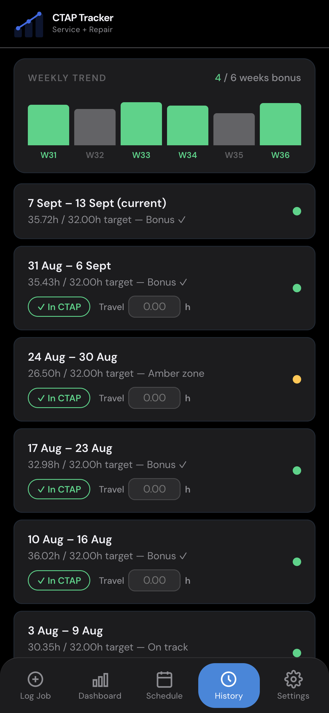

Every past week with a colour-coded dot (green = bonus hit, amber = on
track, red = below).

### Key actions

- **Tap a week** to jump into it (view its dashboard, log jobs into it).
- **"✓ In CTAP" chip** toggles whether a week counts toward your running
  balance. Tap to exclude.

#### Why you can exclude weeks

Real life happens. You might have a week with a freak data issue, a long
sickness absence, or a week you logged into the wrong app — leaving them in
the running balance would skew your view of how you're actually doing. The
toggle lets you flag those weeks as anomalies without deleting the data.

---

## Settings

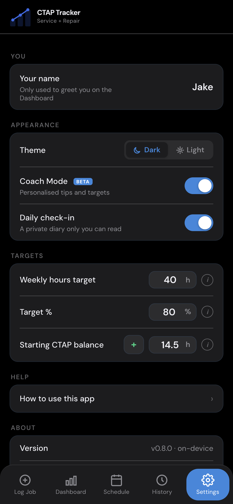

### Appearance

- **Theme**: Dark or Light. Saved per-device.
- **Coach Mode (BETA)**: personalised tips in a bordered card on the
  dashboard. **On by default** — turn it off if you find them noisy. It only
  affects what's shown; it never changes a figure.
- **Daily check-in**: the private end-of-day prompt. On by default, and off
  is a single tap.

### Targets

- **Weekly hours target** — your roster's base hours (default 40).
- **Target %** — what % of rostered hours you're aiming to credit (default
  80%). Tap the **i** for the rationale.
- **Starting CTAP balance** — set this once when you first install. It's
  your banked balance carried in from before you started using the app.

### Help

- **How to use this app** — quick steps, in-app.

### About

- **Version** — and "on-device", which is the whole architecture in a word.
- **Legal & data** — disclaimer, employer separation, data storage and
  retention.
- **Built by** — Jake Rainford, Service & Repair Engineer.
- **Questions or feedback?** — reach out on Teams.

### This data is yours alone

The card at the bottom of Settings, where an account would be in most apps.

- **Erase all data** — wipes every job, week, shift, check-in and setting
  from this phone. Two-step: tap Erase → type ERASE → confirm.
- There is nothing to sign out of, and no copy anywhere else, so erasing
  really is permanent. Deleting the app does the same thing.

---

## Data & privacy

- **On-device, full stop**: every figure you enter lives in this app's
  storage on this phone. There is no account, no server, and no upload.
- **No transmission**: the app doesn't send your data anywhere, because
  there is nowhere for it to go. Once installed it makes no network
  requests at all — even the fonts are served from the app itself.
- **No third parties**: no analytics, no ads, no employer systems, nobody.
- **No backup**: the honest consequence of the above. Nothing is recoverable
  if the phone or the app goes.
- **Right to delete**: Settings → Erase all data. No emails, no waiting.

---

## What's not in scope

- ❌ Not a payslip. Numbers are personal estimates.
- ❌ Not connected to any employer system. You log what you did.
- ❌ Not affiliated with Centrica, British Gas, or any employer. Personal
  tool.

---

## Tech stack (one-liner)

Vanilla JS PWA served as plain static files from GitHub Pages — no bundler,
no backend, no dependencies at runtime. Fonts self-hosted. Offline via a
service worker that precaches the whole shell. Tests run on Vitest.

---

*Screenshot placeholders use the filenames in `docs/guide/screenshots/`.
Once those are dropped in, the guide renders inline on GitHub.*
